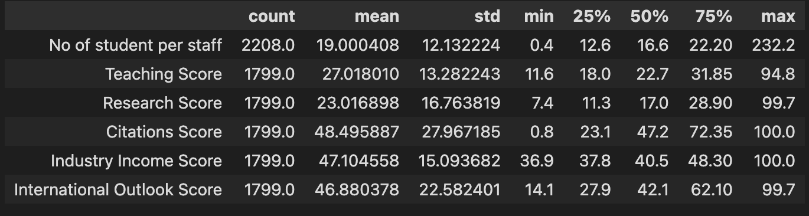
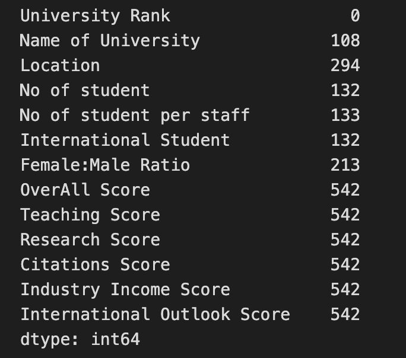
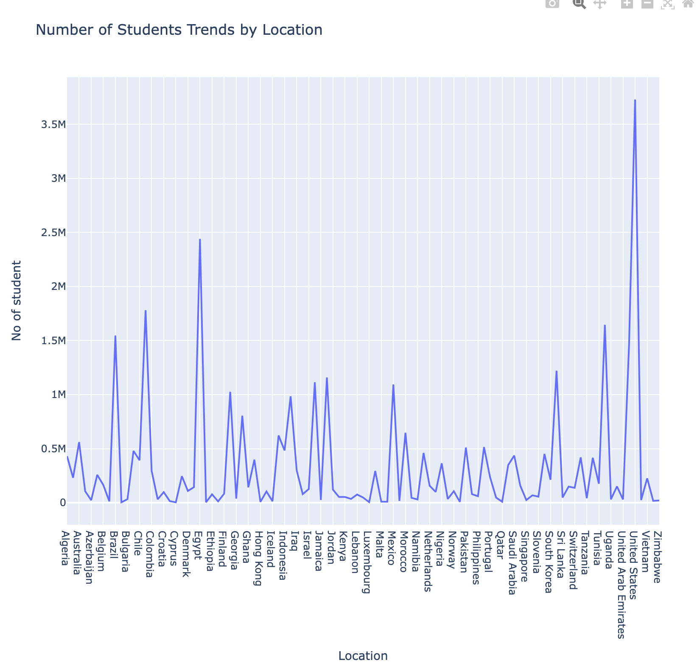
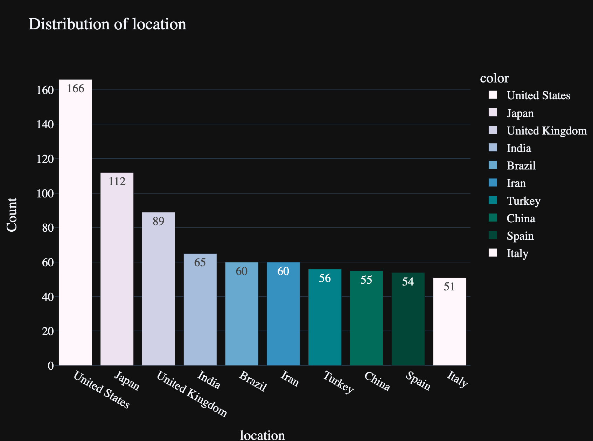
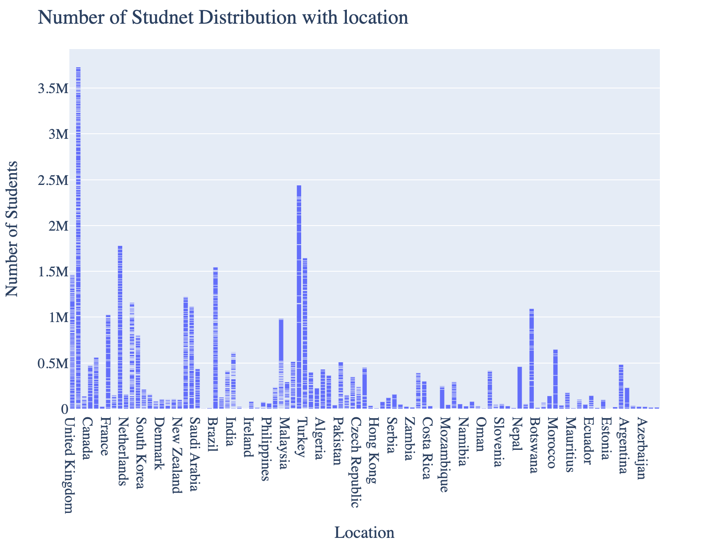
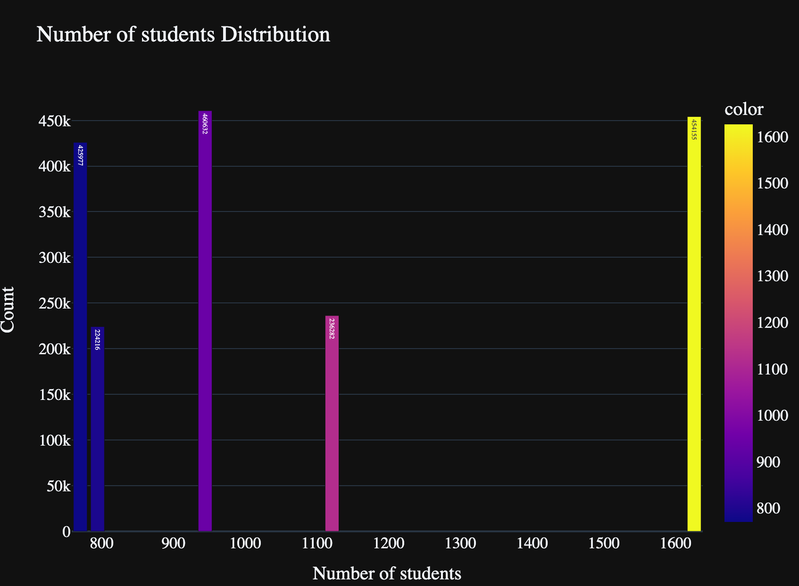

# Individual Project 1  

## Goal

(1) __.ipynb__:

 Cells that perform descriptive statistics using Polars or Panda.
Tested by using nbval plugin for pytest

(2) __Python Script__:

performing the same descriptive statistics using Polars or Panda

(3) __lib.py__:

shares the common code between the script and notebook

(4) __Makefile__ with the following:			

* Run all tests (must test notebook and script and lib)
* Formats code with Python black
* Lints code with Ruff
* Installs code via:  pip install -r requirements.txt
  
(5) __test_script.py__ to test script

(6) __test_lib.py__ to test library
		
(7) Pinned requirements.txt

(8) GitHub Actions performs all four Makefile commands with badges for each one in the README.md
			
## Dataset
source: https://www.kaggle.com/datasets/alitaqi000/world-university-rankings-2023

## Overview

* __.devcontainer__:

define and set up containerized development environments, providing a consistent and isolated workspace for coding and testing applications. It includes a Dockerfile and a devcontainer.json file.

* __Dockerfile__:
  
set up a development container for Python and optionally Node.js development within Visual Studio Code.
devcontainer.json: configure and define a development container environment for use with Visual Studio Code's Remote - Containers extension.
.github/workflows: a special directory used to store workflow configuration files for GitHub Actions(CI/CD). It includes a ci.yml file, which automates the CI process for a code repository.

* __ci.yml__:

triggers code pushes to the "main" branch, pulls requests to the "main" branch, and allows manual triggering. The workflow includes steps to check out code, install dependencies, perform linting, run tests, and apply code formatting. This automation helps maintain code quality and ensures that code changes are continuously tested and validated.
.gitignore: specify patterns of files and directories that should be ignored by Git when tracking changes and making commits in a project.

* __Makefile__:
  
contains a set of rules that define how to automate common development tasks related to a Python project, including installing dependencies, running tests, and maintaining code formatting and code quality standards in a Python project.

* __requirements.txt__: specify Python package dependencies that are required to run the project.

* __script.py__: defines a simple function to describe data and plot figures

* __analysis.ipynb: describe data and plot figures
  
* __lib.py__: defines common functions used in script and analysis.ipynb

* __test_lib.py__: test the functionality defined in the lib.py module.
  
* __test_script.py__:test the functionality defined in the script.py module.

## Requirements
* Python (Version 3.11 or newer)
* pandas (Version 2.1.0)
* matplotlib (Version 3.4.3)
* numpy(Version 1.23.2)
* plotly(Version 5.16.1)
* nbval(Version 0.10.0)
* ruff(Version 0.0.289)
* nbformat(Version 4.2.0)
  
## Run

* install code __make install__

* lint code __make lint__

* format code __make format__

* test code __make test__

* run all steps __make all__

## Output

* Descriptive Statiscs:

* null info

* plots
  

